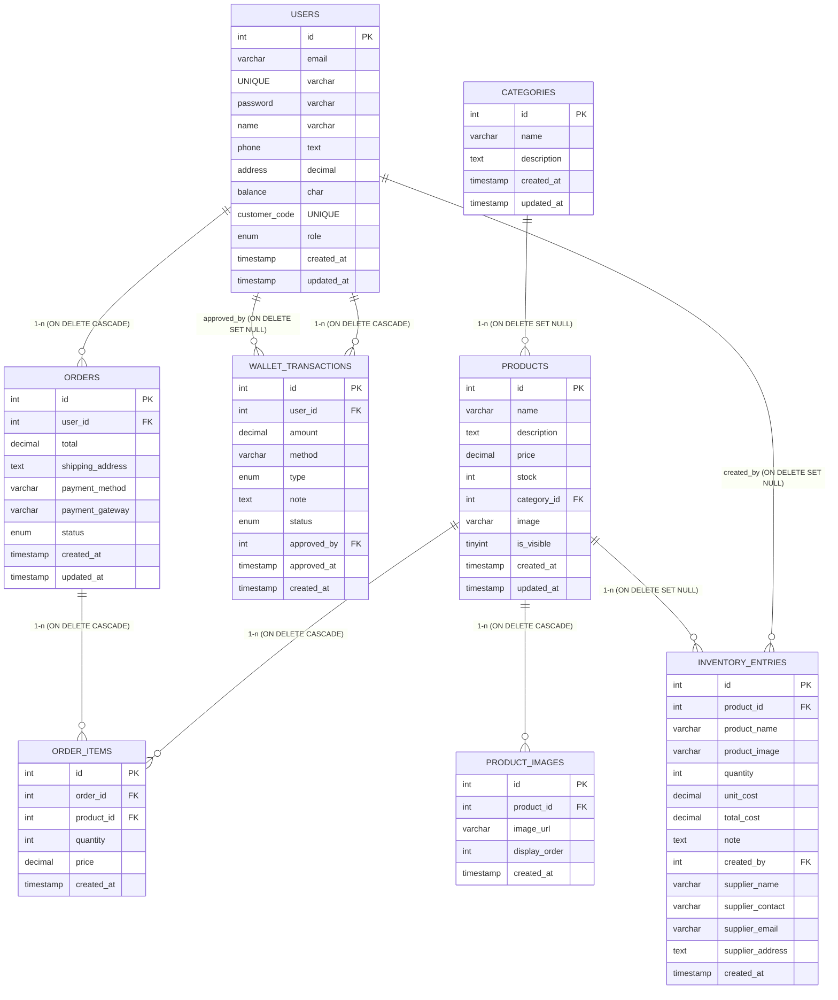

# Lược đồ ERD (quan hệ bảng)

Sơ đồ ở dạng Mermaid cho nhanh chóng, thể hiện các bảng chính và quan hệ cùng hành vi xóa.

## Ghi chú
- `ON DELETE CASCADE`: xóa bản ghi cha sẽ xóa bản ghi con liên quan (đơn hàng, ảnh, order items, giao dịch ví của user).
- `ON DELETE SET NULL`: giữ lịch sử nhưng bỏ liên kết khi bản ghi cha bị xóa (inventory_entries.product_id, inventory_entries.created_by, wallet_transactions.approved_by, products.category_id).
- Có hai quan hệ từ `users` tới `wallet_transactions`:
  - `user_id` (owner giao dịch) — cascade.
  - `approved_by` (người duyệt) — set null.

